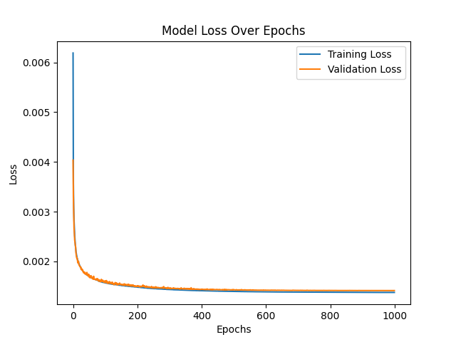
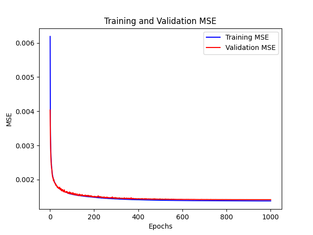

# Convolutional Neural Network (CNN) for [Project Name]

Professional, production-ready README for the repository containing training/inference code and saved artifacts for a CNN model.

> Notes and assumptions
> - This README is written based on the repository files present in the workspace (`CNN.py`, `CNN.txt`, `trained_model.h5`, `scalerX.save`, `scalerY.save`, and training visualizations). If the project uses a different script name or CLI, adjust commands accordingly.

## Table of contents

- [Overview](#overview)
- [Repository structure](#repository-structure)
- [Quick start](#quick-start)
- [Requirements](#requirements)
- [Installation](#installation)
- [Usage](#usage)
  - [Inference example](#inference-example)
  - [Training / Reproduce results](#training--reproduce-results)
- [Model & Data details](#model--data-details)
- [Evaluation & Visualizations](#evaluation--visualizations)
- [Troubleshooting](#troubleshooting)
- [Development notes](#development-notes)
- [Contributing](#contributing)
- [License](#license)
- [Contact & Acknowledgements](#contact--acknowledgements)

## Overview

This repository contains code, saved scalers, a trained Keras/TensorFlow model, and plots produced during training for a Convolutional Neural Network (CNN) that was developed as part of [brief description of the project, e.g., time-series regression, image classification, etc.]. The provided artifacts let you reproduce inference immediately and retrain the model if you have the original raw data.

Main goals:
- Provide a reproducible trained model for inference.
- Provide training code for re-training and experimentation.
- Include saved preprocessing objects (scalers) to ensure inference uses the same transformations.

## Repository structure

Files in this repository (present in this workspace):

- `CNN.py` — Main training / model script (training loop, model definition, save/load hooks). Check inside this script to see available CLI options and hyperparameters.
- `CNN.txt` — Notes, experimental logs, or instructions (opened by the original author).
- `trained_model.h5` — Saved Keras model (HDF5 format). Use `tensorflow.keras.models.load_model` to load for inference.
- `scalerX.save` — Saved input scaler (e.g., scikit-learn’s StandardScaler or MinMaxScaler). Load with `joblib.load()`.
- `scalerY.save` — Saved target/value scaler for inverse-transforming predictions.
- `model loss over epochs.png` — Plot of training & validation loss over epochs.
- `training and validation MSE.png` — Plot of training/validation mean squared error over epochs.

These images are included in the repository and are embedded below for quick reference.

### Training visualizations

Model loss over epochs:



Training and validation MSE:



If you add files, keep this list up to date.

## Quick start

1. Create and activate a virtual environment.
2. Install dependencies (see [Requirements](#requirements)).
3. Run inference using the provided `trained_model.h5` and scalers.

Example (PowerShell):

```powershell
# create virtual env and activate (PowerShell)
python -m venv .venv
.\.venv\Scripts\Activate.ps1
pip install -r requirements.txt
```

Then run your inference script or the snippet in [Inference example](#inference-example).

## Requirements

Minimum recommended Python ecosystem (adapt versions as needed):

- Python 3.8+
- tensorflow >= 2.0 (for model loading + training)
- scikit-learn
- numpy
- pandas (if data loading uses it)
- matplotlib (for plots)
- joblib (for loading .save scalers)
- h5py (for HDF5 model I/O; usually installed with TensorFlow)

A sample `requirements.txt` you can create in the repo:

```
tensorflow>=2.10
scikit-learn
numpy
pandas
matplotlib
joblib
h5py
```

Place that file next to `README.md` and run `pip install -r requirements.txt`.

## Installation

1. Clone the repository.
2. Create and activate a virtualenv (example shown above for PowerShell).
3. Install the Python packages in `requirements.txt`.

Windows PowerShell minimal commands:

```powershell
git clone <repo-url>
cd <repo-folder>
python -m venv .venv
.\.venv\Scripts\Activate.ps1
pip install -r requirements.txt
```

If you are on other platforms, use the corresponding activation commands.

## Usage

### Inference example

The repository includes a ready-to-use `trained_model.h5` and scalers. Here is a minimal example to load the model and run inference (Python):

```python
# inference_example.py
import joblib
import numpy as np
from tensorflow.keras.models import load_model

# Paths to artifacts (adjust to your paths)
MODEL_PATH = 'trained_model.h5'
SCALER_X_PATH = 'scalerX.save'
SCALER_Y_PATH = 'scalerY.save'

# Load artifacts
model = load_model(MODEL_PATH)
scalerX = joblib.load(SCALER_X_PATH)
scalerY = joblib.load(SCALER_Y_PATH)

# Example raw input (replace with your real data; shape must match trained model input)
raw_x = np.array([[0.12, 0.5, 0.3, 0.8]])  # shape: (1, n_features)

# Preprocess, predict, inverse-transform
x_scaled = scalerX.transform(raw_x)
pred_scaled = model.predict(x_scaled)
pred = scalerY.inverse_transform(pred_scaled)

print('Prediction (original scale):', pred)
```

Run the example:

```powershell
python inference_example.py
```

Notes:
- Ensure the shape and feature order of `raw_x` match the training input.
- If your model expects images or sequences, reshape `raw_x` accordingly (e.g., add channel dimension).

### Training / Reproduce results

`CNN.py` is the training script (open it to confirm options). Typical steps to retrain:

1. Ensure your training data is available in the location expected by `CNN.py`.
2. Adjust hyperparameters in `CNN.py` (or pass CLI args if the script supports them), such as epochs, batch size, learning rate.
3. Run the training script:

```powershell
python CNN.py
```

What to check inside `CNN.py` before running training:
- Data loading paths and expected file format.
- Random seeds (set for reproducibility).
- Where the model and scalers are saved (paths and filenames).
- Whether training logs or TensorBoard callbacks are present.

If the script supports flags, run `python CNN.py --help` or open the file header for usage notes (the repo includes `CNN.txt` for additional notes that may explain arguments).

## Model & Data details

Describe here the model architecture and training decisions; add or edit these notes to match your implementation in `CNN.py`:

- Architecture: Convolutional layers followed by fully connected layers. Use dropout / batch normalization as appropriate.
- Loss function: e.g., Mean Squared Error (MSE) for regression or Categorical Cross-Entropy for classification.
- Optimizer: e.g., Adam with learning rate 1e-3.
- Input preprocessing: `scalerX` (StandardScaler or MinMaxScaler) applied to inputs.
- Target preprocessing: `scalerY` applied to outputs for stable training.

Add details from `CNN.txt` to this section if that file contains experiment logs or hyperparameters.

## Evaluation & Visualizations

Included plots:

- `model loss over epochs.png` — training and validation loss across epochs.
- `training and validation MSE.png` — training and validation mean squared error.

These help inspect training behavior (under/overfitting). When retraining, re-generate these plots in the same folder for comparison.

## Troubleshooting

- Model fails to load: Ensure versions of TensorFlow/h5py are compatible; try `pip install -U h5py`.
- Shape mismatch on inference: Confirm input shape/order and whether model expects channels-first vs channels-last.
- Scaler missing or incompatible: The `scalerX.save` and `scalerY.save` were likely created with joblib; load with `joblib.load`. If scalers were created with a different sklearn version, try upgrading/downgrading scikit-learn accordingly.
- GPU issues: If you want GPU acceleration, install the correct TensorFlow build for your CUDA/cuDNN version; otherwise TensorFlow will fallback to CPU.

## Development notes

- Add a `requirements.txt` to pin the dependencies used to produce the saved model.
- Consider adding a small `inference.py` wrapper and `predict.ipynb` example notebook for users.
- Add unit tests for data preprocessing and a smoke test that loads the model and runs a dummy prediction.

Suggested quick smoke test (PowerShell):

```powershell
python - <<'PY'
import joblib
from tensorflow.keras.models import load_model
import numpy as np

model = load_model('trained_model.h5')
scalerX = joblib.load('scalerX.save')
scalerY = joblib.load('scalerY.save')

dummy = np.zeros((1, scalerX.mean_.shape[0]))
d = scalerX.transform(dummy)
print('Model predict OK:', model.predict(d).shape)
PY
```

(Replace `scalerX.mean_` usage if scaler type differs.)

## Contributing

Contributions are welcome. A suggested workflow:

1. Fork the repository.
2. Create a feature branch: `git checkout -b feat/your-feature`.
3. Add tests for new functionality.
4. Open a pull request describing the change and rationale.

Please include reproducible steps and small data samples for bug reports.

## License

This repository is released under the MIT License. See `LICENSE` file or the following summary:

Permission is hereby granted, free of charge, to any person obtaining a copy of this software and associated documentation files (the "Software"), to deal in the Software without restriction, subject to the conditions in the LICENSE file.

## Contact & Acknowledgements

- Author / Maintainer: [Your Name] — replace with your name and contact email in this section.
- Acknowledgements: Add any datasets, libraries, or colleagues who helped with the project.

---

If you'd like, I can also:
- Create a `requirements.txt` populated with the packages above.
- Add a small `inference_example.py` file to the repo that uses the saved artifacts.
- Open `CNN.py` to extract exact CLI/argument usage and embed exact run commands in this README (recommended for precision).

If you want me to make any of these, tell me which and I'll add them now.